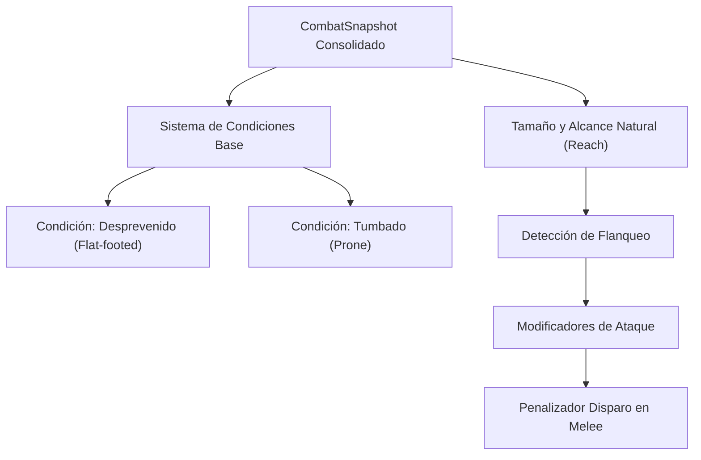

# MVP del Motor de Combate Táctico - D&D 3.5

> **Estado Documental:** Parcialmente supersedido por `spatial-engine-2.5d.md`. Las exclusiones espaciales históricas (movimiento vertical, tamaño, cobertura total, vuelo) han sido superadas por el NDD espacial y las características funcionales subsiguientes.

Este documento define el Alcance Mínimo Viable (MVP) para que el motor táctico de combate de D&D 3.5 sea completamente utilizable por un grupo de juego (GM y jugadores) para resolver un combate táctico completo.

---

## 1. Estado Actual del Motor
El motor cuenta con un servidor autoritativo sincronizado en tiempo real por WebSockets que gestiona salas en memoria. Los participantes (GM y jugadores) tienen roles diferenciados, el posicionamiento en tablero se valida para evitar superposiciones, y se manejan iniciativas manuales para ordenar el turno activo. La economía de acciones implementa acciones estándar (ataque simple) y movimiento (diagonal 5/10/5/10 ft). Además, existe soporte básico para ataques de oportunidad, estados negativos de HP hasta la muerte (-10 HP), y algunos buffs temporales como Luchar a la Defensiva y Defensa Total.

---

## 2. Clasificación de Reglas (Estado y MVP)

### Turnos e iniciativa
* **Implementado**: Iniciativa manual cargada por personaje, ordenamiento descendente en `turnOrder`, avance manual del turno activo y lógica de asalto recurrente.
* **MVP**:
  * **Empates de iniciativa**: Resueltos según el modificador de Destreza más alto (regla oficial D&D 3.5).
  * **Sorpresa**: Estado de asalto sorpresa inicial (limitación a acción estándar o de movimiento).
* **Fuera de MVP**: Tirada automática de iniciativa (los jugadores ingresan manualmente sus tiradas para respetar la filosofía de la mesa física), acción de retrasar y preparar (pueden ser emuladas por el GM reordenando manualmente el `turnOrder` a través de comandos GM).

### Movimiento
* **Implementado**: Ruta paso a paso con coste diagonal 5/10/5/10 ft. Bloqueo de casillas ocupadas por criaturas vivas.
* **MVP**:
  * **Movimiento a través de aliados**: Permitido de forma libre y sin penalización de velocidad (en D&D 3.5 atravesar la casilla de un aliado no cuenta como terreno difícil ni consume movimiento extra). Sin embargo, está prohibido terminar el movimiento en una casilla ocupada por un aliado, y no se permite correr ni cargar a través de ella.
  * **Movimiento a través de enemigos**: Bloqueado por defecto, a menos que el enemigo esté indefenso (helpless).
  * **Doblar esquinas**: Restringido si el muro u obstáculo bloquea la diagonal.
* **Fuera de MVP**: Terreno difícil avanzado, movimiento vertical, vuelo, monturas y reglas de escurrirse.

### Ataques cuerpo a cuerpo
* **Implementado**: Ataque simple como acción estándar con tirada de d20 manual y daño base del arma (con multiplicador de Fuerza para dos manos).
* **MVP**:
  * **1 natural y 20 natural**: Pifia automática y acierto automático.
  * **Ataques iterativos por BAB alto**: Soporte para múltiples ataques en asalto completo (BAB +6/+1, etc.).
  * **Ataque sin armas / Ataques naturales**: Daño no letal por defecto y provocación de AdO al realizarse sin dote.
* **Fuera de MVP**: Daño no letal avanzado, combate con dos armas (salvo versión básica), embestidas y derribos complejos.

### Ataques a distancia
* **Implementado**: Ataque simple con incrementos de alcance y penalizador acumulativo de -2 por incremento posterior al primero. Máximo 5 incrementos para arrojadizas, 10 para proyectiles.
* **MVP**:
  * **Penalizador por disparar a enemigos en combate cuerpo a cuerpo**: Penalizador de -4 al ataque a menos que el atacante posea la dote *Disparo Preciso*.
* **Fuera de MVP**: Dotes complejas como *Disparo rápido*, cálculo dinámico de munición real e inventario restrictivo.

### Ataques de oportunidad (AdO)
* **Implementado**: Provocados al abandonar una casilla amenazada o realizar un ataque a distancia estando amenazado. Bloqueo del flujo del combate por AdO pendientes.
* **MVP**:
  * **Límite de un AdO por criatura por asalto**: Restringido a menos que se tenga la dote *Reflejos de Combate*.
  * **Retirada (Retire)**: Acción de asalto completo que permite abandonar la casilla inicial sin provocar AdO de los enemigos que la amenacen.
* **Fuera de MVP**: Conjurar defensivamente (CD de Concentración) y AdO por levantarse, beber poción o recargar ballestas.

### Acciones tácticas
* **Implementado**: Defensa Total (+4 CA), Luchar a la defensiva (-4 ataque, +2 CA) y Carga (+2 ataque, -2 CA, movimiento en línea recta de al menos 10 ft). Prestar ayuda (+2 ataque o CA a aliado).
* **MVP**:
  * **Carga**: Resolver impacto de AdO sobre la trayectoria de carga antes del ataque.
  * **Prestar ayuda**: Lógica consolidada del asalto.
* **Fuera de MVP**: Derribar, desarmar, embestida, arrollar, presa completa (se gestionan manualmente con tiradas libres y comandos del GM).

### Críticos
* **Implementado**: Ninguno (se introduce de forma manual).
* **MVP**:
  * **Amenaza de crítico**: Rango de amenaza del arma (ej: 19-20).
  * **Tirada de confirmación**: Segunda tirada d20 contra la CA.
  * **Multiplicador de crítico**: Multiplicación del daño base (x2, x3, x4) si se confirma.
* **Fuera de MVP**: Efectos mágicos especiales de crítico (ej. *Flaming Burst*).

### Flanqueo
* **Implementado**: Ninguno.
* **MVP**:
  * **Detección de flanqueo**: Otorgar un bonificador de +2 al ataque cuerpo a cuerpo cuando dos aliados están en lados opuestos del defensor.
* **Fuera de MVP**: Flanqueo con criaturas grandes o alcances complejos.

### Cobertura
* **Implementado**: Ninguno.
* **MVP**:
  * **Cobertura básica**: Bonificador de +4 a la CA y +2 a salvaciones de Reflejos si hay una criatura u obstáculo intermedio en la línea de ataque.
* **Fuera de MVP**: Cobertura total y cobertura parcial avanzada.

### Ocultamiento
* **Implementado**: Ninguno.
* **MVP**:
  * **Ocultamiento básico**: Probabilidad de fallo del 20% (ej. por niebla o penumbra).
* **Fuera de MVP**: Ocultamiento total (50% de fallo, imposibilidad de ataques de oportunidad).

### Condiciones
* **Implementado**: Ninguno.
* **MVP**:
  * **Sistema base de condiciones**: Soporte de estados temporales aplicados a combatientes que alteran mecánicas directamente. En el MVP se priorizarán:
    * *Desprevenido (Flat-footed)*: Pérdida del modificador de Destreza a la CA. No se pueden realizar ataques de oportunidad. Se aplica automáticamente al inicio del combate a todos los combatientes que aún no hayan actuado.
    * *Tumbado (Prone)*: -4 a ataques cuerpo a cuerpo, -4 CA contra ataques cuerpo a cuerpo, +4 CA contra ataques a distancia. Levantarse cuesta acción de movimiento y provoca AdO.
* **Fuera de MVP**: *Aturdido (Stunned)* (postergado para una iteración posterior), cegado, ensordecido, asustado y enmarañado.

### Tamaños
* **Implementado**: Todos los personajes ocupan 1 casilla (Mediano/Pequeño).
* **MVP**:
  * **Modificadores de tamaño**: Tabla básica de bonificadores/penalizadores a CA y ataque por categoría de tamaño.
* **Fuera de MVP**: Criaturas de tamaño Grande o superior ocupando múltiples casillas en el mapa interactivo (se modelarán como Medianos en el mapa pero con sus modificadores de tamaño aplicados a estadísticas).

### Alcance / Reach
* **Implementado**: Todos los combatientes tienen 5 ft de alcance cuerpo a cuerpo.
* **MVP**:
  * **Alcance natural y armas de alcance (Reach weapons)**: Permitir amenazar y atacar a 10 ft con armas como la pica (longspear), bloqueando ataques a 5 ft si el arma lo requiere.
* **Fuera de MVP**: Amenazas de alcance dinámicas por combinación de tamaños y formas.

### Armas
* **Implementado**: Carga estática de estadísticas de arma desde el catálogo compartiendo perfil de ataque.
* **MVP**:
  * **Identificación del tipo de arma**: Ligera, una mano, dos manos.
* **Fuera de MVP**: Inventario dinámico e intercambio de armas durante el combate.

### Armaduras / Escudos
* **Implementado**: Derivación automática de la CA total considerando la armadura y el escudo equipados en el perfil de catálogo.
* **MVP**:
  * **Penalizador de armadura al movimiento**: Reducción de la velocidad base (ej. 30 ft a 20 ft con armadura pesada).
  * **Límite de Destreza máximo a la CA** (Max Dex Bonus).
* **Fuera de MVP**: Penalizadores de armadura a tiradas de habilidad específicas (salvo acrobacias si se implementa).

### Buffs / Debuffs
* **Implementado**: Haste (+1 ataque/CA, +10 ft velocidad), Defensa Total, Carga, Aid Another, Luchar a la Defensiva.
* **MVP**:
  * **Expiración automática por ronda**: Lógica unificada para decremento de buffs al inicio/fin del turno del emisor.
* **Fuera de MVP**: Bonificadores acumulativos según su tipo (en el MVP los buffs se suman linealmente).

### Hechizos básicos
* **Implementado**: Acciones mágicas demo de Cure Light Wounds y Magic Missile.
* **MVP**:
  * **Soporte de hechizos básicos como habilidades**: Implementación formal con slots de conjuros diarios limitados.
* **Fuera de MVP**: Sistema de contraconjuros, resistencia mágica, y componentes de lanzamiento.

### Muerte / Estabilización
* **Implementado**: HP hasta -10. Muerte a -10 HP. Estado incapacitado a 0 HP. Estado moribundo de -1 a -9 HP con tirada de estabilización del 10% por turno.
* **MVP**:
  * **Pérdida automática de 1 HP**: Un personaje moribundo pierde 1 HP al final de su turno si no está estabilizado.
* **Fuera de MVP**: Prueba de Sanar CD 15 realizada por un aliado para estabilizar.

---

## 3. Matriz de Prioridad de Implementación

| Prioridad | Sistema / Regla | Justificación | Dependencias |
| :--- | :--- | :--- | :--- |
| **1** | **Consolidación de CombatSnapshot** | Base arquitectónica para leer y aplicar reglas sin mutar estados dispersos. | Ninguna |
| **2** | **Amenazas y Confirmación de Críticos** | Esencial para cualquier combate; determina la letalidad de las armas de catálogo. | Ninguna |
| **3** | **Sistema de Condiciones Base** | Requerido para Desprevenido y Tumbado. | `CombatSnapshot` |
| **4** | **Detección de Flanqueo** | Modificador táctico más común en D&D 3.5. | Tablero / Posiciones |
| **5** | **Cobertura y Ocultamiento Básicos** | Necesario para combate a distancia y uso de obstáculos. | Tablero / Posiciones |
| **6** | **Tamaño y Alcance Natural (Reach)** | Permite criaturas Grandes/Picas que amenazan más allá de 5 ft. | `CombatSnapshot` |

---

## 4. Dependencias Técnicas entre Reglas

---

## 5. Riesgos Técnicos y Mitigaciones
1. **Acoplamiento de Reglas en la UI**:
   * *Riesgo*: Que la UI intente resolver si hay flanqueo para mostrar un botón.
   * *Mitigación*: La UI enviará la intención de ataque; el servidor determinará el flanqueo, aplicará el bonificador y devolverá el desglose en el log de combate.
2. **Pérdida de Rendimiento en Detección de Flanqueo/Cobertura**:
   * *Riesgo*: Cálculos geométricos repetitivos sobre el tablero en cada renderizado.
   * *Mitigación*: Implementar funciones puras memorizadas en el cliente únicamente para previsualización visual, manteniendo el cálculo autoritativo en el servidor al enviar el comando.

---

## 6. Estrategia de Testing
- **Pruebas Unitarias**: Cada regla táctica pura (como `isFlanked(attacker, defender, room)`) se implementará en `packages/shared/src/rules.ts` y se probará con fixtures de tablero estáticos en `tests/rules.test.mjs`.
- **Pruebas E2E**: Casos complejos de flujo (ej. carga interrumpida por un AdO que tumba al atacante) se escribirán como flujos secuenciales en `scripts/e2e-websocket.mjs`.

---

## 7. Recomendación del Siguiente Sistema a Implementar
Se recomienda encarecidamente iniciar con la **Consolidación del CombatSnapshot**. Esto proporcionará una estructura de datos inmutable sobre la cual el motor de reglas (Rule Engine) podrá consultar condiciones (tumbado, desprevenido), flanqueo, y cobertura de manera determinista y aislada del estado de red o de la UI.

---

## 8. Filosofía del MVP
El objetivo primordial de este MVP no consiste en abarcar el 100% del reglamento oficial de D&D 3.5, sino en proveer un motor táctico robusto y autoritativo capaz de resolver correctamente la enorme mayoría de las interacciones en combates habituales de una mesa física. Las situaciones y reglas altamente específicas o excepcionales (como presas complejas, derribos avanzados o magia circunstancial) se reservan para iteraciones de desarrollo posteriores. Esto permite enfocarse en la solidez arquitectónica, asegurando que cada nuevo bloque de reglas se acople de manera limpia, predecible y sin comprometer la integridad estructural ni la mantenibilidad del proyecto a largo plazo.
